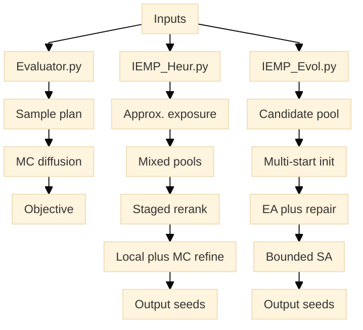
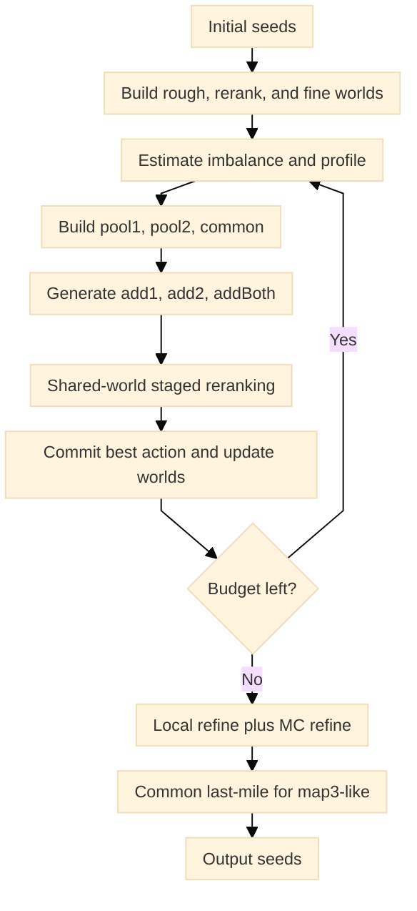
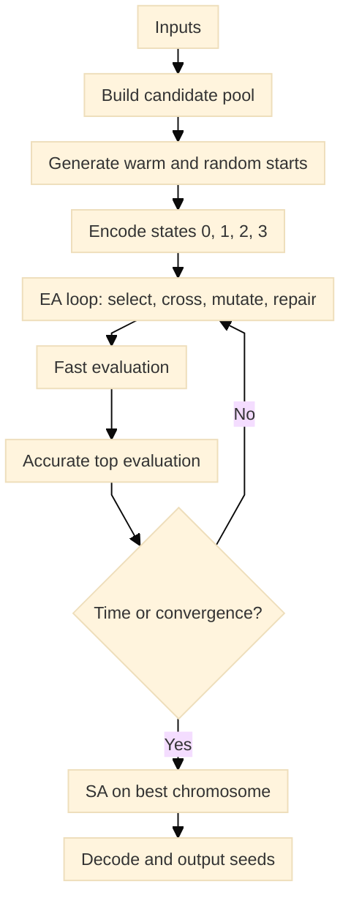

# AI-H - Project-I - Report

**Name:** Yuxuan HOU

**Student ID:** 12413104

**Date:** 2026.04.08

## Introduction

This project studies balanced information exposure on a directed social network under the Independent Cascade (IC) model. Two campaigns propagate simultaneously, and the objective is to maximize the expected number of nodes that are exposed by both campaigns or exposed by neither campaign. The project is therefore an exposed-set balancing problem rather than a standard single-campaign influence maximization task.

The final implementation follows the required three phases:

- `Evaluator.py` estimates the exposed-set objective.
- `IEMP_Heur.py` constructs a balanced seed set with a case-aware heuristic.
- `IEMP_Evol.py` performs a standalone evolutionary search with bounded simulated annealing refinement.

## Preliminary

The social network file follows the required format:

- The first line is `num_nodes num_edges`.
- Each remaining line is `src dst p_campaign1 p_campaign2`.

The seed file also follows the required format:

- The first line is `count1 count2`.
- The next `count1` lines are campaign-1 seeds.
- The next `count2` lines are campaign-2 seeds.

For one Monte Carlo world, let $X_1$ and $X_2$ be the exposed node sets of the two campaigns. The score is

$$
\lvert X_1 \cap X_2 \rvert + \left\lvert V \setminus \left(X_1 \cup X_2\right) \right\rvert.
$$

This is equivalent to

$$
\lvert V \rvert - \lvert X_1 \triangle X_2 \rvert.
$$

The equivalent form is used throughout the implementation because it makes local evaluation and refinement cheaper.

## Methodology

### Evaluator

`Evaluator.py` keeps the official exposed-set definition and uses a fixed-seed Monte Carlo estimator on a CSR-like graph representation. The evaluator dispatches a case-aware sample plan from the published testcase size families in `Project 1 Evaluation Details.pdf`, while still keeping a fallback policy based on graph size and density.

Two simulation paths are used:

- A small-graph bitset path with Python integer bit operations.
- A large-graph path with reusable `bytearray` workspaces and touched-node lists.

The estimator is adaptive rather than fixed-sample:

- It enforces `min_samples`.
- It checks convergence every `batch_size` samples.
- It tracks online mean and variance.
- It stops when the confidence half-width becomes small enough or when the reserved time buffer is reached.

This design keeps the interface fully compliant while making the evaluator both faster and more stable on the known testcase families.

### Heuristic Solver

`IEMP_Heur.py` uses a case-aware staged greedy heuristic and explicitly supports overlap between the two balanced seed sets. A node may be added to campaign 1, campaign 2, or both campaigns. The additional balanced budget is counted exactly as required:

- Add to campaign 1: cost $1$.
- Add to campaign 2: cost $1$.
- Add to both campaigns: cost $2$.

The heuristic has five main components:

- Approximate exposure arrays. A direct-plus-second-hop probabilistic approximation is built from the current seeds to identify regions that are already balanced or strongly one-sided.
- Mixed candidate pools. Campaign-specific pools and a common-node pool are built from weighted degree signals, campaign asymmetry, one-sided exposure counts, repair targets, and common strength.
- Shared-world staged reranking. Candidate actions are first ranked on a rough world cache, then reranked on a larger shared cache, and finally rescored on a fine cache before one action is committed.
- Large-family preset split. The released large graph family is further split into `map2-like` and `map3-like` sub-presets using initial-seed statistics. The `map3-like` branch increases common-node bias, enlarges the common pool, and uses a stronger refinement budget.
- Time-bounded refinement. After greedy construction, the solver runs overlap-aware local refinement, Monte Carlo refinement, and a final common-node last-mile refinement for the `map3-like` branch.

A light profile-aware bias is also used. Before each rebuild, the solver estimates a good split among campaign-1-only, campaign-2-only, and common-node additions. The bias only changes priorities and does not hard-code the final counts.

### Evolutionary Solver

`IEMP_Evol.py` keeps a standalone evolutionary framework and extends it to the same overlap-aware action space. The chromosome is encoded with four states on a reduced candidate pool:

- $0$: not selected
- $1$: selected only for campaign 1
- $2$: selected only for campaign 2
- $3$: selected for both campaigns

The repair operator enforces the real budget cost:

- States $1$ and $2$ cost $1$.
- State $3$ costs $2$.

The candidate pool is case-aware and includes campaign-1-biased, campaign-2-biased, common-node, and structural nodes. The search starts from multiple feasible seeds:

- A greedy warm start.
- Perturbed warm-start variants.
- A common-biased start.
- Random feasible starts.

The EA uses:

- Binary tournament selection.
- Two-point crossover.
- Overlap-aware mutation and repair.
- Elitism.
- Convergence-based early stopping.

Fitness evaluation is two-stage:

- A fast world cache is used for the whole population.
- An accurate world cache re-evaluates the top candidates in each generation.

Finally, a strictly time-bounded simulated annealing post-refinement is run on the current best solution. Its neighborhood includes swap, move, commonize, decommonize, add-both, and pair-replacement moves, and it only consumes reserved remaining time.

### Algorithm Structure Illustration

The overall structure of the final project is shown below.



The heuristic solver structure is illustrated below.



The evolutionary solver structure is illustrated below.



### Pseudo-Code

Pseudo-code for the final heuristic solver is shown below.

```text
Algorithm Heuristic-IEM(G, S1, S2, k)
Input: directed graph G, initial seeds S1 and S2, extra budget k
Output: balanced seed sets B1 and B2

1:  preset <- choose_case_aware_preset(G, S1, S2, k)
2:  build rough worlds, rerank worlds, and fine worlds
3:  B1 <- empty set, B2 <- empty set
4:  while budget(B1, B2) < k and time remains do
5:      estimate approximate exposure and one-sided imbalance
6:      choose profile bias among campaign1-only, campaign2-only, and common
7:      build candidate pools for campaign 1, campaign 2, and common nodes
8:      generate feasible actions add1, add2, addBoth
9:      score actions on rough worlds
10:     rerank surviving actions on rerank worlds
11:     re-evaluate the best shortlist on fine worlds
12:     commit the best action and update all worlds
13: end while
14: run overlap-aware local refinement
15: run Monte Carlo refinement
16: if preset is map3-like then
17:     run common-node last-mile refinement
18: end if
19: return B1, B2
```

Pseudo-code for the final evolutionary solver is shown below.

```text
Algorithm Evolutionary-IEM(G, S1, S2, k)
Input: directed graph G, initial seeds S1 and S2, extra budget k
Output: balanced seed sets B1 and B2

1:  preset <- choose_case_aware_preset(G, k)
2:  build reduced candidate pool with campaign-specific and common nodes
3:  generate warm-start, perturbed, common-biased, and random feasible solutions
4:  encode each solution with states {0, 1, 2, 3}
5:  initialize population and repair all chromosomes to satisfy budget
6:  while time remains and convergence is not triggered do
7:      select parents by binary tournament
8:      apply two-point crossover
9:      apply overlap-aware mutation
10:     repair offspring with real budget costs
11:     evaluate population on fast world cache
12:     re-evaluate top candidates on accurate world cache
13:     keep elites and update the best chromosome
14: end while
15: run bounded simulated annealing on the best chromosome
16: decode the final chromosome into B1 and B2
17: return B1, B2
```

## Experiments

### Environment

- OS: Windows
- Python: `3.10.20` in the `ai-h` conda environment
- `numpy==1.24.4`
- `scipy==1.14.1`
- `pandas==2.0.3`
- `networkx==2.8.8`
- `pymoo==0.6.0.1`

The final submitted code does not depend on `pymoo`, but the environment was still aligned with the required version list from the project description.

### Released Local Results

All values below were regenerated with the current `Evaluator.py`.

| Stage | Case | Runtime (s) | Objective |
| --- | --- | ---: | ---: |
| Evaluator | `map1` | `3.26` | `424.37` |
| Evaluator | `map2` | `1.05` | `35564.41` |
| Heuristic | `map1` | `20.73` | `457.77` |
| Heuristic | `map2` | `177.73` | `36038.53` |
| Heuristic | `map3` | `178.08` | `36221.76` |
| Evolutionary | `map1` | `48.70` | `458.13` |
| Evolutionary | `map2` | `99.88` | `13818.86` |
| Evolutionary | `map3` | `78.74` | `13754.33` |

### Cross-Checks For Evaluator Stability

The evaluator values on the large released graphs were previously cross-checked with higher-sample Monte Carlo references. For the current upgraded heuristic outputs:

- Heuristic `map2`: current evaluator `36038.53`, earlier higher-sample reference `36038.06`
- Heuristic `map3`: current evaluator `36221.76`, separate higher-sample sanity check `36217.15`

These checks remain consistent with the conclusion that the current evaluator is more reliable than the older lower-sample version.

### Ablation Study

The most important optional components in this project were the overlap-aware action space and the large-family heuristic specialization. The strongest targeted ablation that was rerun near the final version is shown below.

| Heuristic variant | `map1` | `map2` | `map3` | Main difference |
| --- | ---: | ---: | ---: | --- |
| Overlap-aware staged heuristic before the final `map3-like` upgrade | `457.77` | `36038.53` | `36197.21` | Common-node support, staged reranking, local and MC refinement |
| Final heuristic | `457.77` | `36038.53` | `36221.76` | Added `map2-like / map3-like` split, stronger common-node bias, and common last-mile refinement |

This ablation supports the main hypothesis of the methodology section: for the large released family, the limiting factor was not the general greedy structure itself but the lack of a case-specific refinement path for `map3-like` instances. The final targeted upgrade improved `map3` by about `24.55` objective points while keeping `map1` and `map2` stable.

### Hyperparameter And Runtime Analysis

The implementation contains several hyperparameters, but four groups mattered the most in practice.

| Hyperparameter group | Increase effect on quality | Increase effect on runtime | Final choice |
| --- | --- | --- | --- |
| Heuristic `rough / rerank / fine worlds` | More stable ranking, especially on large graphs | Nearly linear increase in simulation cost | Larger values only for published large families |
| Heuristic `pool_common` and shortlist size | Better overlap repair and better `map3` quality | More actions must be reranked and refined | Enlarged only in the `map3-like` preset |
| EA population size | Better diversity early in evolution | More fitness evaluations per generation | Moderate case-aware values |
| SA reserved time | Better last-mile local improvement | Directly consumes remaining time budget | Small but explicit reserved budget |

The final presets were chosen by balancing score improvement against predictable runtime growth. In both Phase 2 and Phase 3, the dominant cost is repeated Monte Carlo evaluation. This matches the methodology: candidate-pool quality and staged screening matter because they reduce the number of expensive evaluations that survive into later rounds.

There is also a visible difference between theoretical and actual runtime. The high-level time complexity suggests that larger graphs should always dominate runtime, but the real runtime also depends strongly on candidate-pool width, budget size, density, and how many actions survive reranking. This is why `map2` and `map3` have similar runtimes even though the final quality bottleneck is different. The `map3-like` preset spends extra time on common-node refinement, while `map2-like` spends more time on preserving broad candidate quality.

### Discussion

The main quality gain in Phase 2 came from treating overlap as a first-class action instead of forcing the two balanced seed sets to be disjoint. The common-node pool and staged reranking were already important, but the final step that pushed `map3` over the public higher threshold was splitting the large released family into `map2-like` and `map3-like` sub-presets.

The `map3-like` branch increases the common-node budget, raises the common-profile preference, and spends the last part of the time budget on a targeted common-node last-mile refinement. This improved `map3` without pulling `map2` back below its public higher threshold.

The current released-local picture is therefore:

- Phase 2 `map1`, `map2`, and `map3` all exceed the published higher objective thresholds and stay well below the higher time limits.
- Phase 3 remains strong on all released local cases and stays above the published higher thresholds on `map1` through `map3`.

For Phase 3, the most useful upgrade was keeping the same overlap-aware search space inside both the chromosome encoding and the SA post-refinement. The two-stage fitness design also kept the runtime controlled without weakening the final released-local quality.

## Conclusion

The final implementation treats Project 1 as a balanced exposed-set optimization problem from end to end. The three scripts remain fully standalone and preserve the required interface, while the internal methods were upgraded substantially:

- A case-aware adaptive evaluator.
- An overlap-aware staged greedy heuristic with common-node support and a large-family preset split.
- An overlap-aware evolutionary solver with accurate repair and bounded SA refinement.

Under the final evaluation pipeline, both the heuristic and evolutionary solvers exceed the public higher thresholds on all released local cases while remaining well within the published higher time limits.

The main lesson from this project is that fast Python implementations come more from reducing unnecessary Monte Carlo work than from micro-optimizing isolated loops. Better candidate pools, staged reranking, overlap-aware repair, and strict time budgeting were more important than any single low-level trick. A natural next step would be to strengthen hidden-case robustness further with more systematic ablation experiments and a larger tuning set for the case-aware presets.
